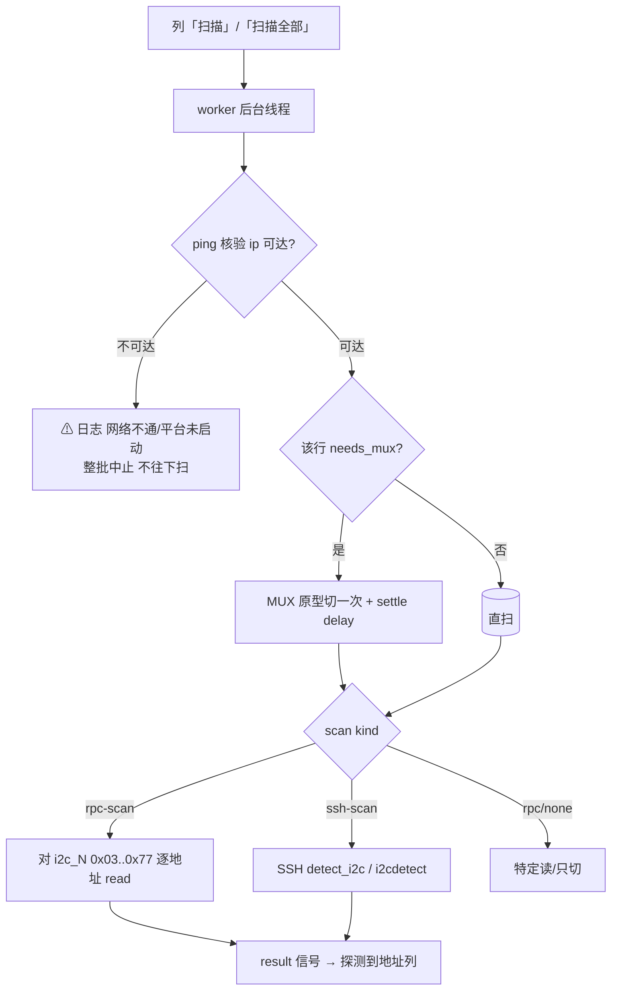

# I2c-Scan 插件 — 板卡 I2C 扫描 / 插卡自检

> 调试场景：板卡插上后程序起不来，常是某条 I2C 总线（尤其 mux 门控后那条）上的
> 器件没到位。本插件把「选个要扫的总线 → 需要的话先切 mux → 逐个读地址 → 列表展示」
> 做成通用 Qt 工具。核心框架把“扫什么 / 怎么切 mux”都抽成**一张数据表**，
> 换项目 = 换表，不改插件代码。

---

## 一、加载与入口
- 目录 `plugins/i2c_scan_plugin/`，类 `I2cScanPlugin`；已加进 `plugins/plugins.json`
  （`"i2c_scan"`），随主程序加载成标签页 `I2C-Scan vX.Y`。

---

## 二、UI 界面设计

```
┌──────────────────────────────────────────────────────────────┐
│ 目标与扫描驱动  项目▾ [IP][RPC端口][SSH用户][SSH密码]…[连接测试]│
├──────────────────────────────────────────────────────────────┤
│ 按槽位扫描  [扫描全部]   当前扫描命令:<probe/方式摘要>            │
│  ┌───────────────┬──────────────┬────┬────────────────────┐ │
│  │ 扫描对象      │ 切 mux        │ 扫描│ 探测到地址         │ │
│  ├───────────────┼──────────────┼────┼────────────────────┤ │
│  │ ARRAY板 I2C0  │ 不需要切 mux  │ 扫描│ 0x77 …            │ │  ←直扫
│  │ WIB板 CH1     │ 不需要切 mux  │ 扫描│ 0x20,0x21,0x50    │ │
│  │ Base DOE 通道2│ [切 mux]      │ 扫描│ …                 │ │  ←需先切
│  └───────────────┴──────────────┴────┴────────────────────┘ │
├──────────────────────────────────────────────────────────────┤
│ 调试日志(只读)  ping 核验/每步/结果/错误                        │
└──────────────────────────────────────────────────────────────┘
```

关键交互规则（避免误导）：
- 「切 mux」列 **只对真正需要先切 mux 的行**放 `切 mux` 按钮；
  不需要切的行放灰色文字 **`不需要切 mux`**（不是可点的“切 mux”，免得误操作）。
- 每行一个「扫描」；列 3 结果为逗号分隔的地址，也进 tooltip。
- 后台线程 + Qt 信号回主线程更新 UI（不直接改控件）。

#### 核心控件
| 控件 | 类型 | 作用 |
|---|---|---|
| `cbProject` 项目 | `QComboBox` | 切项目=换 TESTTABLE/SLOTS，重绘表 |
| `edIp/edRpcPort/edSshUser/edSshPass` | `QLineEdit` | 目标机/端口/SSH |
| `btnTest` 连接测试 | `QButton` | 真 TCP 探测 ip:7801/22 → 日志 |
| `btnScanAll` / 每行「扫描」 | `QButton` | 后台依序 / 单行扫 |
| `lblProbe` 摘要 | `QLabel` | 该行将要跑的扫法摘要 |
| `table` | `QTableWidget` | 4 列扫描表 |
| `log` | `QPlainTextEdit` | 调试日志 |

---

## 三、核心逻辑（多链路）与统一动作

把所有控制/扫描动作归一成一个 **“op”= driver 列表**：
- `rpc-call`：切 mux/发控制（原样 int 下发，JsonRpcClient `_send_request`）
- `rpc-scan`：软件地址遍历扫总线（`_ensure_client` + 逐地址 read）
- `rpc`：一般 stub 调用
- `ssh`/`ssh-scan`：板壳跑 detect_i2c/i2cdetect（**需 PTY**）
- `delay`：步间等待

### 单对象执行序列（ping 最先）
```
step 0  可达性核验 ping(ip:7801 或 :22)
        └ 不通 → 中止（后续切 mux/扫全无意义）
step 1  可选 mux 前置: 该行带 mux ? 执行 MUX 原型切的动作 + settle 延时
step 2  对该行 scan 目标扫地址
step 3  (release_ops 可选) 收尾
```

flowchart（Mermaid）：

字符版：
```
 扫描按钮 ─worker线程─▶ [0] 可达性 ping
                         │ 不通 ⚠ 中止
                         ▼
                    [1] 需切?──是──▶ MUX原型切 + settle
                         │ 否
                         ▼
                    [2] scan: rpc-scan/ssh-scan/none
                         ▼
                  result 信号 ─▶ 写回“探测到地址”
                         ▼
                  finished ─▶ 恢复 UI
```

---

## 四、给“新项目”加一条/一个项目的模板（推荐用法）

框架唯一的通用入口是 `hook_base.make_table_hook(...)`，项目文件只需声明
**PROJECT + SLOTS + MUX_PROTO** 三样（见 `projects/b610.py`）：

```python
PROJECT = {'name':'xx','title':'...','default_ip':'..','default_port':7801,
           'settle_ms':250}
# 不同项目“怎么切 mux”可能不同：给一份切法原型即可
MUX_PROTO = {'driver':'rpc-call','service':'i2c_mux_base',
             'method':'set_channel_state_doe'}
SLOTS = [
  # 直接扫（不需切）
  {'key':'WIB-CH1','label':'WIB板','scan':'i2c_6','expected':['0x20','0x21','0x50']},
  # 需要先切(DOE3) 再扫
  {'key':'DUT-DOE3','label':'DOE3','scan':'i2c_2','mux':3,'expected':['0x50']},
]
```
通用执行器会把 SLOTS 自动翻译成步骤（mux 原型 + 扫每个目标），你不用再写那些散布的
`mux_ops/probe` 函数。DOE 通道与物理总线/预期地址按实机检校后改一行即可。

### 若某项目切法特殊（非一根 RPC 能切完）
- 每行 `mux` 给完整 op 列表即可：`'mux':[ {...op}, {'driver':'delay','ms':300} ]`
- 或 `MUX_PROTO` 给 `callable(channel)->[op]`。

---

## 五、连通性诊断（日志第一性）
```
连接参数: ip=192.168.99.34 rpc_port=7801 ssh_user=mixadmin
网络诊断 192.168.99.34 : RPC=不通  → 请检查网线/网关/……平台进程是否在跑
⚠ 无法连接 …:7801 → 网络不通或平台未启动。已停止后续扫描。
```
它会区分“网络不通”和“总线上无器件”；ping 不通时会作为第一步中止整个批量动作。
